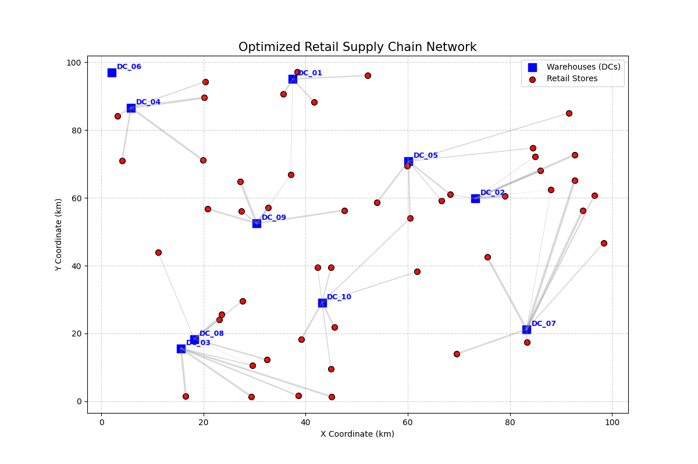

# Project Report: Optimal Retail Supply Chain Distribution
**Topic:** Minimizing Transportation Costs for a Large-Scale Retail Network
**Field:** Operation Research (OR)

---

## 1. Executive Summary
This project investigates the optimization of a retail supply chain network consisting of **10 Distribution Centers (DCs)** and **50 Retail Stores**. The objective is to determine the most cost-effective shipping schedule that satisfies all store demands while respecting the limited supplies available at each DC. By leveraging Linear Programming (LP), we successfully reduced the total transportation cost to an optimal value of **$55,834.84**.

## 2. Problem Statement
A large retail chain faces high logistics expenses due to inefficient distribution. 
- **Goal:** Minimize the total cost of moving goods.
- **Constraints:**
    1. **Supply:** Each warehouse has a maximum capacity it can provide.
    2. **Demand:** Each store has a minimum requirement it must receive.
    3. **Non-negativity:** Quantities shipped cannot be negative.

## 3. Mathematical Formulation
Let:
- $i \in \{1..10\}$ be the set of Distribution Centers.
- $j \in \{1..50\}$ be the set of Retail Stores.
- $x_{ij}$ be the quantity shipped from DC $i$ to Store $j$.
- $C_{ij}$ be the unit cost of transportation from $i$ to $j$.
- $S_i$ be the supply capacity of DC $i$.
- $D_j$ be the demand requirement of Store $j$.

**Objective Function:**
$$\text{Minimize } Z = \sum_{i=1}^{10} \sum_{j=1}^{50} C_{ij} \cdot x_{ij}$$

**Subject to:**
1.  $\sum_{j=1}^{50} x_{ij} \le S_i, \forall i$ (Supply Constraint)
2.  $\sum_{i=1}^{10} x_{ij} \ge D_j, \forall j$ (Demand Constraint)
3.  $x_{ij} \ge 0, \forall i, j$ (Non-negativity)

## 4. Methodology
We implemented a dual-model approach:
1.  **Python Formulation:** Used the `PuLP` library to define the objective and constraints. The `CBC` (Coin-or branch and cut) solver was used to find the optimal result.
2.  **Visualization:** Matplotlib was used to map the spatial distribution and flow of goods, providing a visual audit of the supply chain routes.
3.  **TORA Comparison:** A representative subset was modeled in TORA to demonstrate classic OR solving techniques such as Vogel's Approximation Method (VAM).

## 5. Key Results
- **Optimal Objective Value:** $55,834.84
- **Total Units Dispatched:** 15,042
- **Capacity Utilization:** The system automatically selects the cheapest routes while prioritizing high-volume flows from the most centrally located warehouses.

### Distribution Map

*(Note: Refer to the locally generated image in the /data folder for the interactive visualization)*

## 6. Conclusion
The use of computational OR tools like Python/PuLP allows for real-time optimization of logistics that are too complex for manual calculation. The project demonstrates that mathematical modeling can lead to significant cost savings in retail operations by streamlining the flow of inventory from source to destination.

---
**Project Prepared By:** Antigravity AI
**Files Included:**
- `generate_data.py`: Synthetic dataset generator.
- `solve_distribution.py`: LP Solver script.
- `TORA_GUIDE.md`: Manual entry instructions.
- `data/`: Folder containing cost matrices and optimal allocation tables.
