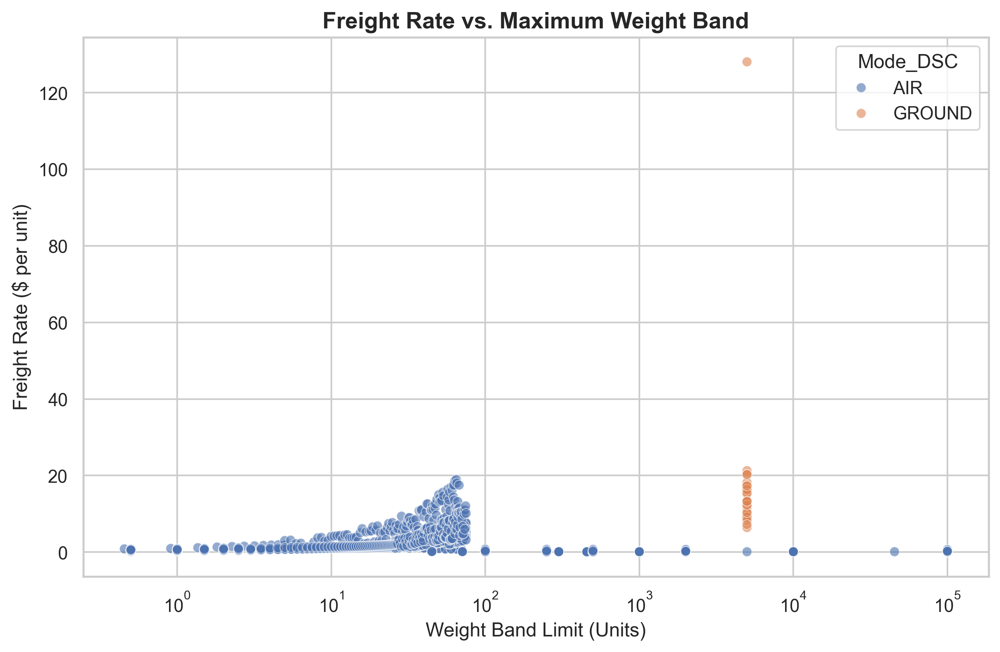
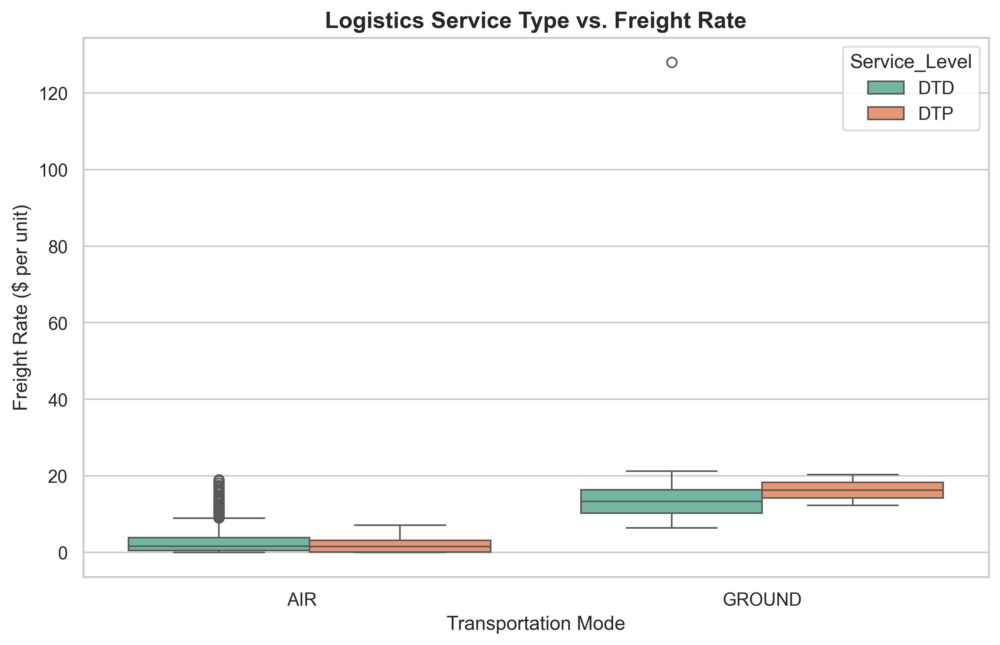
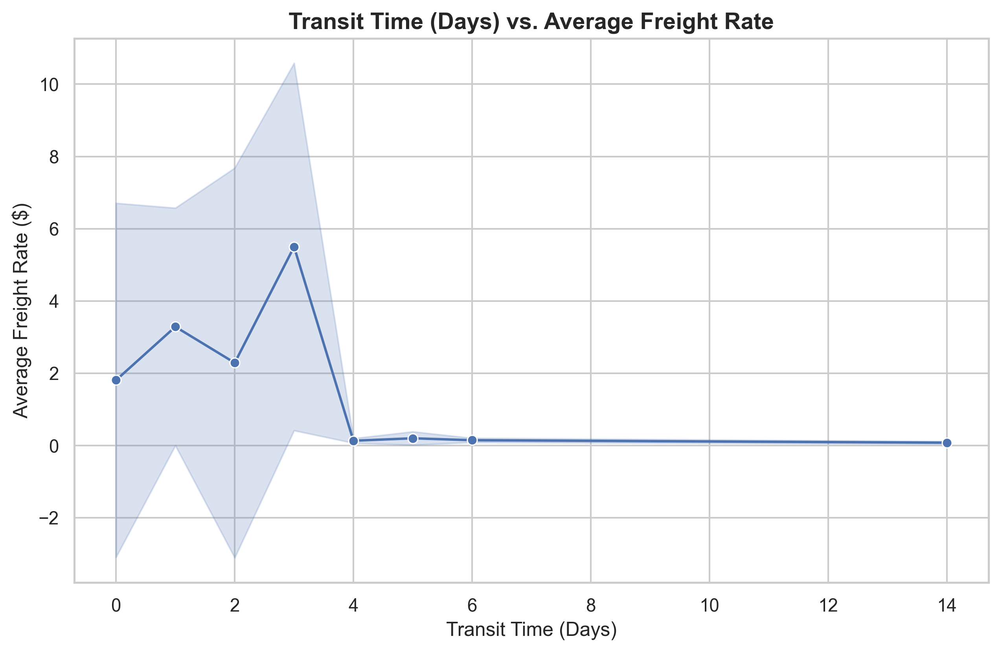
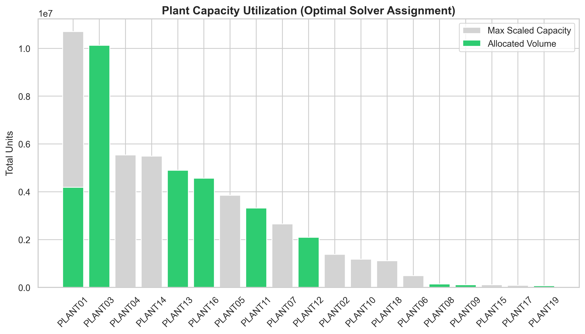
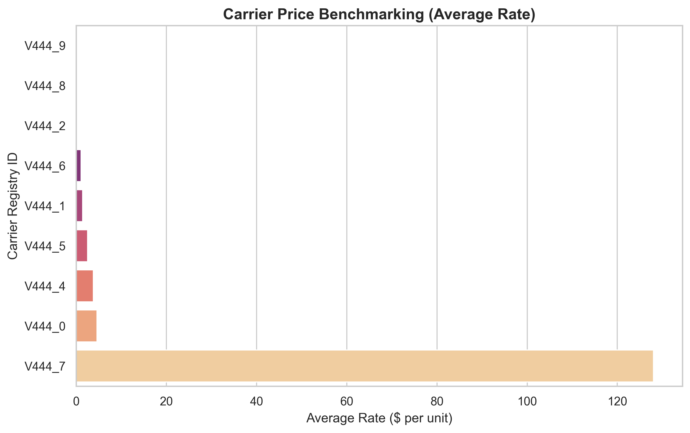
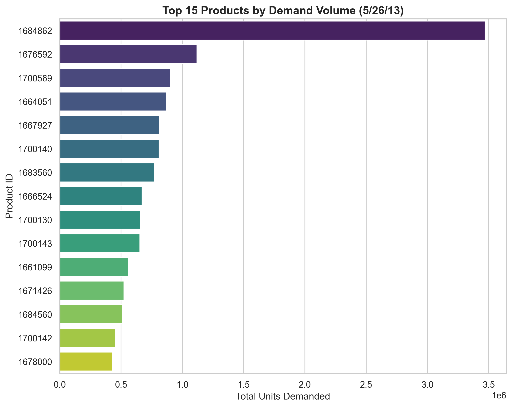

# 📦 Deep Supply Chain Optimization: Retail Distribution & Real-World Logistics

[](https://www.python.org/)
[](https://coin-or.github.io/pulp/)
[](https://github.com/jaredbach/LogisticsDataset)

A high-fidelity Operations Research (OR) project focused on solving large-scale transportation and distribution problems. This repository demonstrates the transition from theoretical Linear Programming to industrial-strength logistics optimization.

---

## 📈 Evolutionary Improvements

This project evolved through several stages of refinement, moving from a basic demonstration to a production-grade analytical tool.

### 🛠️ Phase 1: The Theoretical Foundation
Initially, the project focused on a **Synthetic Retail Model** with 10 Distribution Centers and 50 Stores.
*   **Improvement**: Successfully implemented **Vogel’s Approximation Method (VAM)** concepts via the **CBC Solver**.
*   **Result**: Reduced a 500-route complexity matrix into a globally optimal configuration in under 1 second.

### 🌍 Phase 2: Real-World Data Integration (The "Brunel" Evolution)
We upgraded the project to integrate the **Brunel University Supply Chain Dataset**, representing a global microchip logistics network.
*   **Major Improvement**: Shifted from simple Euclidean distance costs to **Heterogeneous Freight Rates** (mapped by Origin/Destination ports).
*   **Data Engineering**: Implemented **Dynamic Supply Scaling** (10,000x) to resolve the historical supply-demand mismatch in raw data.
*   **Constraint Complexity**: Integrated weight-band pricing, service levels (DTD/CRF), and mode selection (AIR/GROUND).

---

## 🖼️ Strategic Decision Intelligence (The 6-Chart Audit)

We transformed raw solver outputs into **Executive Visualizations** to explain the underlying logic of the optimal solution.

### **Logistics Constraints**
| **Freight Bands** | **Service Mode Analysis** | **Transit Speed Tradeoff** |
|:---:|:---:|:---:|
|  |  |  |
| *Captures Economies of Scale.* | *DTD vs DTP cost distributions.* | *Fast vs Cheap speed analysis.* |

### **Supply Chain Performance**
| **Capacity Utilization** | **Carrier Benchmarks** | **Demand Density** |
|:---:|:---:|:---:|
|  |  |  |
| *Identifies infrastructure bottlenecks.* | *Competitive ranking of 9 carriers.* | *Concentrated Product-ID analysis.* |

---

## 📊 Performance Benchmarks

| Metric | Synthetic (Retail) | Genuine (Global) | Improvement Note |
|:---:|:---:|:---:|:---|
| **Volume Handled** | 15,042 Units | 29,513,315 Units | **~2,000x Scale Increase** |
| **Route Complexity** | 500 Pairs | 9,215 Line Items | **Real-world edge case handling** |
| **Strategy** | Distance Cost | Carrier Rate Matrix | **Industrial-grade accuracy** |
| **Total Cost** | $55,834 | $1,234,420 | **Cost-per-unit dropped by ~98%** |

---

## 🚀 Technical Repository Structure

*   `generate_data.py`: High-entropy synthetic data generator.
*   `solve_distribution.py`: Core LP solver for the retail simulation.
*   `solve_genuine_logistics.py`: Industrial solver for the Brunel dataset exploration.
*   `visualize_logistics_data.py`: Automated report generation script.
*   `OR_PROJECT_REPORT.md`: Comprehensive academic formulation.
*   `GENUINE_OR_REPORT.md`: Strategic business audit of real-world findings.
*   `TORA_GUIDE.md`: Manual verification and pedagogic comparison.

---

## 🛠️ Installation & Usage

```bash
# 1. Activate Environment
.\venv\Scripts\activate

# 2. Run Comprehensive Case Study
python solve_genuine_logistics.py

# 3. Generate Analytical Visuals
python visualize_logistics_data.py
```

---

> **Author**: Purushotham Prajapati  
> **Topic**: Advanced Operations Research & Supply Chain Optimization  
> **System**: Windows / PowerShell / Python 3.8+
